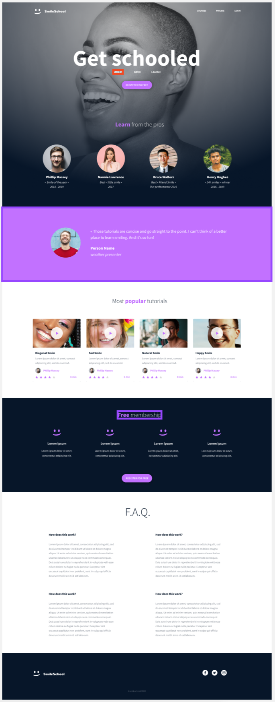

# 😁 Smiling School — ALX CSS Advanced Project



Welcome to **Smiling School**, an ALX **CSS Advanced** project designed to help students **practice and master real-world HTML and CSS layout techniques**.  
This project focuses on building a **fully responsive landing page** using semantic HTML, reusable components, media assets, and modern typography concepts.

---

## 🚀 **Project Overview**

This webpage demonstrates:

- Responsive layout structure using semantic HTML5 elements
- CSS styling fundamentals and component layout planning
- Typography (line-height, custom fonts, spacing)
- Working with images, icons, and grid-based content blocks
- UI components such as headers, navigation, cards, quotes, and a footer

The project includes:

- A **navigation bar**
- A **hero section** with a call-to-action
- **Tutor profile section**
- **Customer testimonial**
- **Card-style tutorial gallery**
- **Membership plan section**
- **FAQ section**
- **Footer with social icons**

---

## 🧠 Learning Objectives

By completing this project, students will:
| Skill | Description |
|-------|------------|
| HTML5 structure | semantic tags, accessibility awareness |
| CSS Layout | display models, spacing, sizing, flex layout |
| Typography | font scaling, line-height, text-transform |
| Responsive design | viewport meta tag, adaptive content |
| Reusability | repeating card layouts & component design |
| Asset handling | working with SVG, PNG, Google fonts & FontAwesome |

---

## 🛠 **Tech Stack**

| Technology  | Used For                 |
| ----------- | ------------------------ |
| HTML5       | Structure & semantics    |
| CSS3        | Styling & responsiveness |
| FontAwesome | Icons                    |
| Fakeimg     | Placeholder images       |

---

## 📂 **Project Structure**

```plaintext
project-folder/
│── index.html
│── images/
│── README.md
└── styles.css
```
